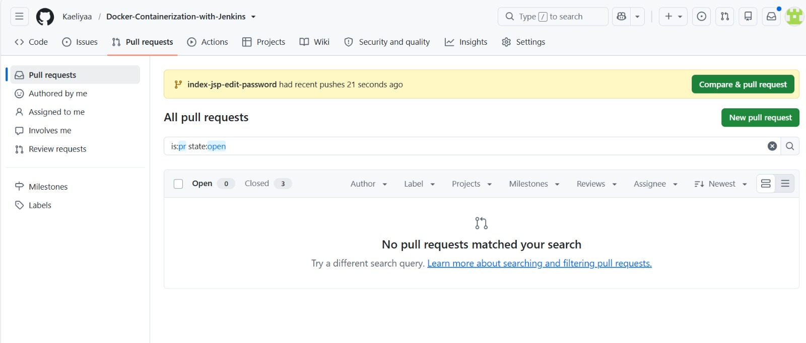
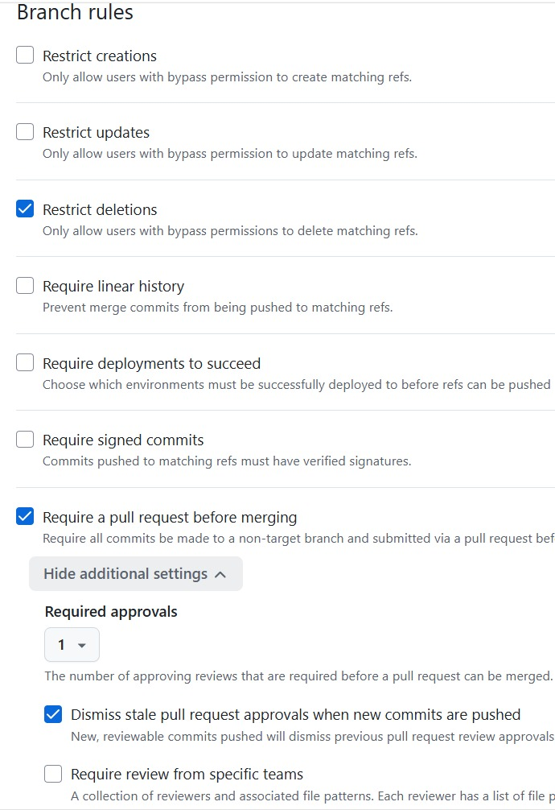
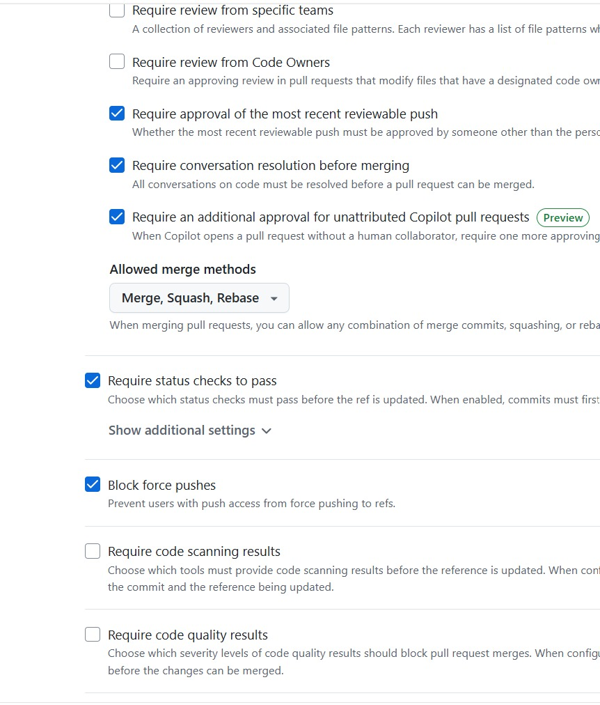
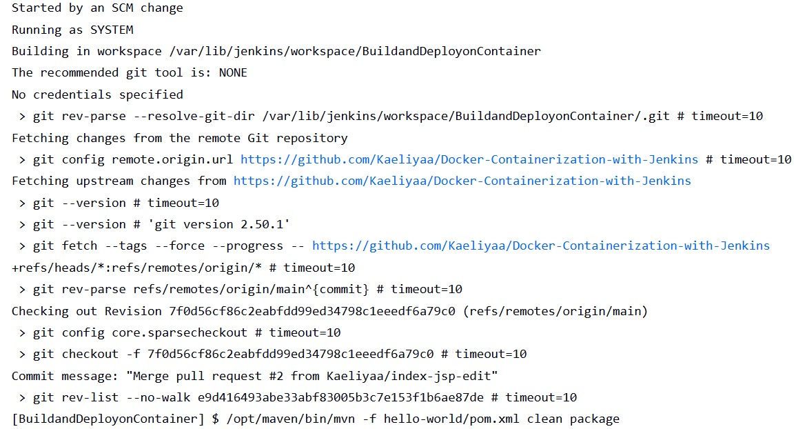
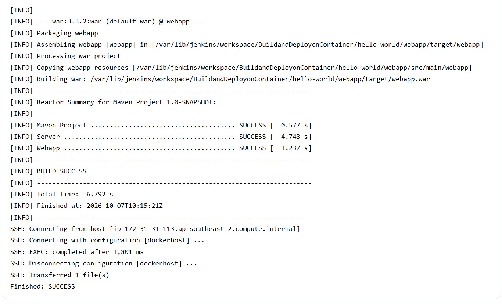
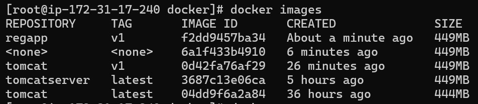
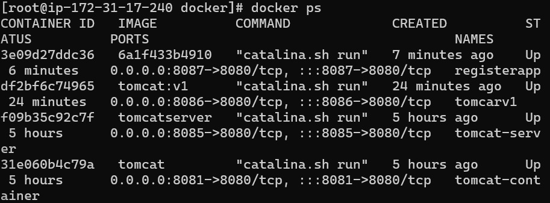
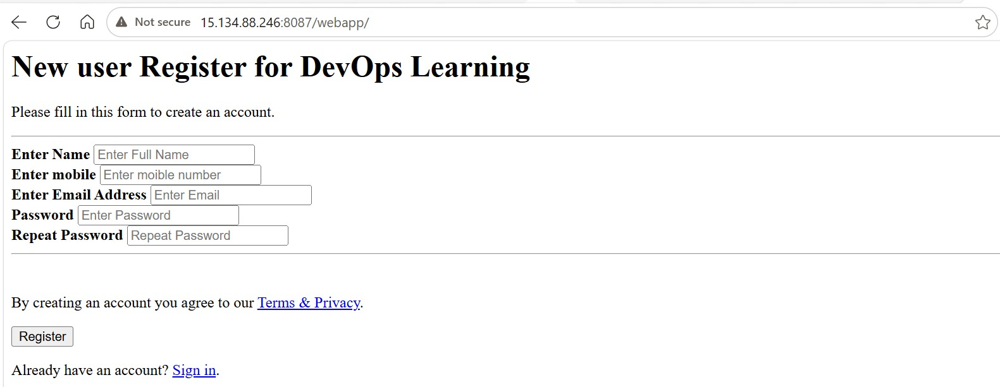

# Docker Containerization with Jenkins

A hands-on DevOps project to understand containerization with simple CI/CD method workflow for a Java web application using **GitHub, Jenkins, Maven, Docker, and AWS EC2**.

This project was based on **NotHarshhaa's DevOps Project-05: *Deploy your code on a Docker Container using Jenkins on AWS***. The tutorial was used as the starting point, while the implementation was adapted to my environment and configuration.

## Workflow

```text
GitHub
   │
   │ Pull Request / Merge
   ▼
GitHub Webhook
   │
   ▼
Jenkins
   │
   ├── Checkout
   ├── Maven Build & Test
   ├── Generate webapp.war
   └── Transfer Artifact
          │
          ▼
     Docker Host
          │
          ├── Build Image
          └── Run Container
                  │
                  ▼
           Deployed Web App
```

## Project Structure

```text
hello-world/
├── server/
├── webapp/
├── Dockerfile
├── pom.xml
├── regapp-deploy.yml
└── regapp-service.yml
```

The project uses a multi-module Maven structure:

```text
server  →  server.jar
webapp  →  webapp.war
```

The generated web application artifact is:

```text
hello-world/webapp/target/webapp.war
```

## GitHub Workflow

I used **Pull Requests and branch rules** to control changes to `main`.







I also added a **GitHub Webhook** so that repository changes can trigger the Jenkins job automatically.



## Jenkins Build

Jenkins checks out the repository and runs:

```bash
mvn -f hello-world/pom.xml clean package
```

Maven builds the two modules and produces the required WAR artifact.



The WAR is then transferred to the Docker host using **Publish Over SSH**.

```text
Source:
hello-world/webapp/target/*.war
```

After the transfer, Jenkins executes:

```bash
cd /opt/docker
docker build -t regapp:v1 .
docker run -d --name registerapp -p 8087:8080 regapp:v1
```

## Docker Deployment

The Docker host builds the application image and runs it as a container.





The application is exposed through:

```text
Host:8087 → Container:8080
```



## Adaptation & Troubleshooting

The original tutorial and my environment used different software versions and project configurations, so several steps required adjustment.

### JDK and Maven Versions

The versions used in the original project were outdated compared with the versions available in my environment. This included the Java version specified in the POM, the JDK installed on the Jenkins server, and the Maven version.

Because these components are related, the original configuration could not always be used directly. I had to update or adjust the environment and configuration so that the project could be built successfully with the available versions.

This was one of the main reasons several parts of the tutorial required workarounds rather than being followed exactly as written.

### Maven Project Path

The tutorial assumed the POM was available directly from the workspace, while my project uses:

```text
hello-world/pom.xml
```

The Jenkins Maven command was therefore changed to:

```bash
mvn -f hello-world/pom.xml clean package
```

### Artifact Transfer

The first SSH transfer returned:

```text
SSH: Transferred 0 file(s)
```

The WAR itself had been generated successfully. The issue was the source path configured in Publish Over SSH.

The tutorial used:

```text
webapp/target/*.war
```

while my repository required:

```text
hello-world/webapp/target/*.war
```

After adjusting the path:

```text
SSH: Transferred 1 file(s)
```

These issues helped me understand how the **Jenkins workspace, Maven project structure, generated artifacts, SSH transfer paths, and Docker build context** are connected.

## What I Learned

* Maven multi-module project structure and build lifecycle
* Jenkins workspace and job configuration
* JAR and WAR artifacts
* GitHub Pull Requests and branch rules
* GitHub Webhooks and Jenkins triggers
* Publish Over SSH
* Docker images, containers, and port mapping
* Debugging issues by tracing the artifact across each stage
